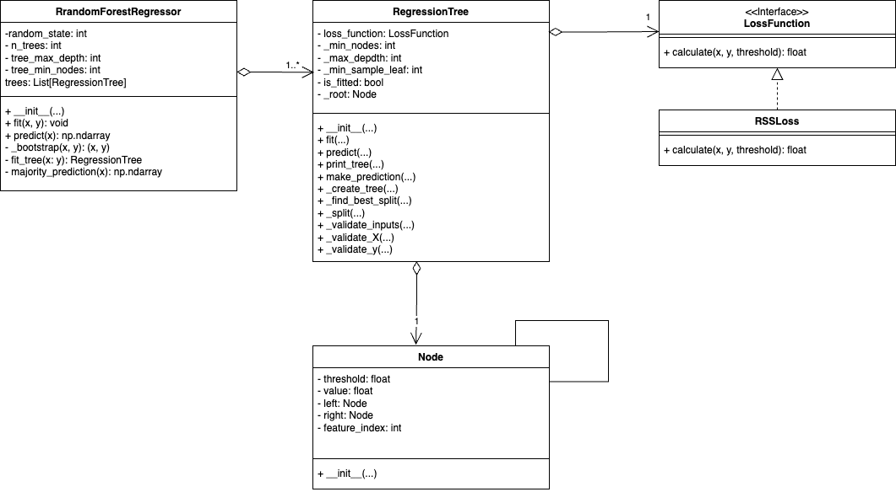

# Exercise 2 - Custom Random Forest Regression Model

## Getting Started

1. Create a python virtual environment

```sh
python3 -m venv .venv
```

2. Activate virtual environment 

- Mac / Linux

```sh
source .venv/bin/activate
```

- Windows

```sh
.venv\Scripts\activate
```

3. Install requirements

```sh
pip install -r requirements.txt
```

# Data Sets

Download both datasets. Make sure you are in the python environment and installed the requirements before this step.
```shell
python download_datasets.py
```

## Bike Sharing
https://archive.ics.uci.edu/dataset/275/bike+sharing+dataset

The Bike Sharing Dataset provides historical data from a bike-sharing system, capturing variables such as weather conditions, seasonality, and time-related features like holidays and weekdays, along with the frequency of bike rentals. The objective of this regression task is to predict the demand for the bike-sharing system based on these features (environmental settings), enabling better insights into rental patterns and system load.

Bike-sharing rental process is highly correlated to the environmental and seasonal settings. For instance, weather conditions, precipitation, day of week, season, hour of the day, etc. can affect the rental behaviors.

Dimensions: 13
Instances: 17.389
Missing Values: No

Target Attribute
The target attribute is the count of total rental bikes, cnt. For the dataset that contains hourly data, this attribute ranges from 1 to 977. For the dataset that contains daily data, this attribute ranges from 22 to 8714.


## Online News Popularity

https://archive.ics.uci.edu/dataset/332/online+news+popularity

This dataset summarizes a heterogeneous set of features about articles published by Mashable in a period of two years. The goal is to predict the number of shares in social networks (popularity).

The articles were published by Mashable (www.mashable.com) and their content as the rights to reproduce it belongs to them. Hence, this dataset does not share the original content but some statistics associated with it. The original content be publicly accessed and retrieved using the provided urls.
* Acquisition date: January 8, 2015
* The estimated relative performance values were estimated by the authors using a Random Forest classifier and a rolling windows as assessment method.  See their article for more details on how the relative performance values were set.

## Directory Structure
The custom implementation can be found in `random_forest/`, while `random_forest_chatGPT/` contains the implementation generated by ChatGPT.

Executing custom_vs_sklearn.py will run a comparison of the custom implementation, sklearn random forest, and sklearn KNN for a single dataset. The dataset can be selected on lines 84 and 101, with the options being "bike" and "popularity".

